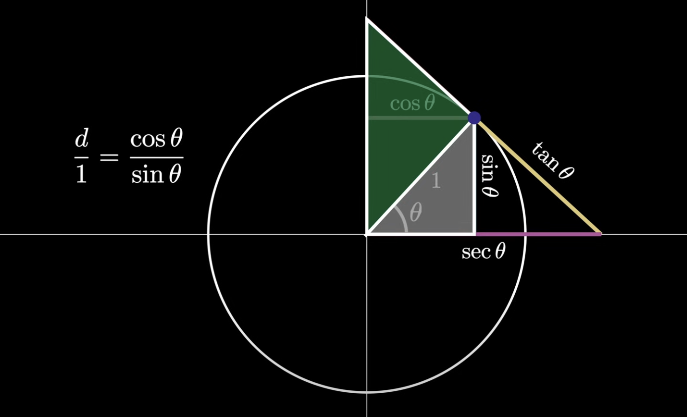
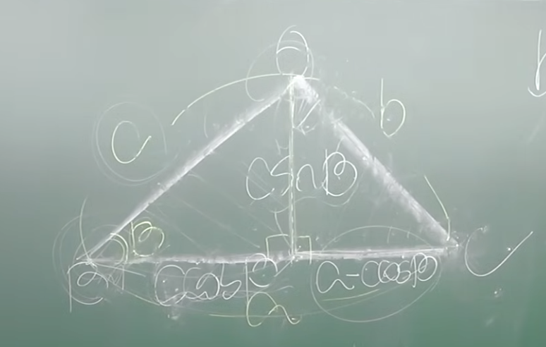

# 1 picture summary


unit circle(r=1)에서\
sin/cos/tan\
csc/sec/cot


# 0. meta

1. define axioms
2. build bottom up from axioms, verify everything as you build on top of it with axioms

# 1. axioms: 삼각비(sin / cos / tan)


삼각비 = sin/cos/tan = 삼각형의 **변의 비율**

1. sin = opposite/hypotenuse
2. cos = adjacent/hypotenuse
3. tan = opposite/adjacent = sin/cos

---
takeaway

1. 빗변, 세로변, 밑변이 늘거나 줄어도, sin(theta), cos(theta), tan(theta)는 변하지 않는다. 변의 '비율'이니까.
2. sin/cos 이해는 원과 삼각형의 관계를 이해하는 것과 같다.

# 2. axiom: tan 유도하기 from sin/cos + tan는 기울기다.


반지름이 1인 원에서,\
밑변은 cos(theta) 왜냐면, 밑변 / 빗변이 cos(theta)인데, 빗변이 1이니까,\
세로변은 sin(theta) 왜냐면, 세로변 / 빛변이 sin(theta)인데, 빗변이 1이니까

근데 (1, cos, sin) 삼각형이랑 (1, tan, x축) 큰 삼각형이랑 닮은꼴임.\
cos(theta) : sin(theta) = 1 : x\
-> sin(theta) = x * cos(theta)\
-> x = sin(theta) / cos(theta)\
-> x = tan(theta)


**탄젠트는 저 perpendicular line의 기울기다!**\
왜?\
높이/밑변 이니까.

점(x,y)에서 기울기가 tan인데,\
1사분면, 3사분면에서는 기울기가 우상향이라 양수 -> tan도 양수\
2사분면, 4사분면에서는 기울기가 우하향이라 음수 -> tan도 음수


# 3. sec, cot, csc 유도하기


csc = 1/sin = 빗변/세로변\
sec = 1/cos = 빗변/밑변\
cot = 1/tan = 1 / (sin / cos) = cos / sin = 빝변/세로변


## 3-1. sec 유도

cos(theta):1 = 1 : x\
1 = x * cos(theta)\
x = 1 / cos(theta)\
x = sec(theta)

## 3-2. cot 유도


x:1 = sin(theta) : cos(theta)\
sin(theta) = x * cos(theta)\
x = cos(theta) / sin(theta) = cot(theta)


## 3-3. csc 유도


## 3-4. trig 공식 유도


걍 피타고라스 정리 쓴거임


# 4. axiom: 각을 숫자로 변환하기: radian

반지름이 r일 때, 호도 r일 때의 각이 1 radian 으로 약속함.

왜?

각을 숫자로 변환하기 위함


# 5. pi = 3.141592 radian

180도 = pi\
90도 = pi / 2\
30도 = pi / 6\
60도 = pi / 3\
45도 = pi / 4


| θ (Degrees) | θ (Radians) | sin(θ)       | cos(θ)       | tan(θ)               |
|-------------|-------------|--------------|--------------|----------------------|
| 0°          | 0           | 0            | 1            | 0                    |
| 30°         | π/6         | 1/2          | √3/2         | 1/√3                 |
| 45°         | π/4         | √2/2         | √2/2         | 1                    |
| 60°         | π/3         | √3/2         | 1/2          | √3                   |
| 90°         | π/2         | 1            | 0            | Undefined (∞)        |
| 180°        | π           | 0            | -1           | 0                    |
| 270°        | 3π/2        | -1           | 0            | Undefined (-∞)       |
| 360°        | 2π          | 0            | 1            | 0                    |


ex1. sin(60) = sin(pi/3) = √3/2\
ex2. cos(30) = cos(pi/6) = √3/2


# 6. 특수각일 때 삼각비
theta 각도일 때 마다 비율이 달라지는데,

(굳이 30,45,60,90 도만 삼각비 구한 이유는 사람의 능력으로 구할 수 있으니까임. 다른 별 이유는 없다)


| θ (Degrees) | θ (Radians) | sin(θ)       | cos(θ)       | tan(θ)               |
|-------------|-------------|--------------|--------------|----------------------|
| 0°          | 0           | 0            | 1            | 0                    |
| 30°         | π/6         | 1/2          | √3/2         | 1/√3                 |
| 45°         | π/4         | √2/2         | √2/2         | 1                    |
| 60°         | π/3         | √3/2         | 1/2          | √3                   |
| 90°         | π/2         | 1            | 0            | Undefined (∞)        |
| 180°        | π           | 0            | -1           | 0                    |
| 270°        | 3π/2        | -1           | 0            | Undefined (-∞)       |
| 360°        | 2π          | 0            | 1            | 0                    |


# 7. l과 theta만으로 원의 좌표, 삼각형의 길이 구하기


빗변이 l이고, theta 각일 때,

1. 밑변 = cos(theta) * l\
왜?\
cos(theta) = 밑변 / 빗변\
-> 밑변 = cos(theta) * l

2. 세로변 = sin(theta) * l\
왜?\
sin(theta) = 세로변 / 빗변\
-> 세로변 = sin(theta) * l


원의 좌표 = (cos(theta) * l, sin(theta) * l)

r(radius)가 1이기만 하면,\
**theta가 0~2pi 어느게 됬든, 원의 좌표는 (cos(theta), sin(theta))가 된다!**


여기가 algebra와 geometry의 만남


# 8. cos법칙



아무삼각형에서 수선의 발을 내려 직각삼각형을 만들었을 때,\
밑변 = c*cos(B)\
세로변 = c*sin(B)

여기까지가 배운거

그러면, 오른쪽 밑변은 a - (c*cos(B)) 유도 가능

그러면, 피타고라스 정리로,\
b^2 = c*sin(B)^2 + (a- c*cos(B))^2\
계산하면,\
cosB = (c^2+a^2-b^2) / 2ca

Q. 이게 왜 유용?\
A. theta 각 1개랑, 3변의 관계에 대한 식임


# 9. sin법칙


유도는 반원에서 어딜 찍어서 만든 삼각형도 각도 90도 (왜냐면 호는 안쪽 각도의 절반인데, 180 / 2 = 90이라)

여기서 출발


# 10. sin, cos의 이해

원의 특징: 돌면 제자리로 돌아온다. 올라갔다 내려갔다 진자운동을 반복함


sin을 pi/90 옮긴게 cos


# 11. wave


wave을 이루는 3가지

1. frequency(주파수)
	- The number of cycles the sine wave completes in a unit of time or distance.
	- Controls how "fast" the wave oscillates. A higher frequency means the wave oscillates more quickly
	- 단위는 오메가(w) 쓰는데, 오메가 = n개 주기(cycle) / 시간(t) ex. 특정 주기에 3번 요동치면 3/1 = 3w
	- Frequency allows customization of the wave's pattern to simulate phenomena like sound waves, light waves, or periodic signals with different oscillation rates.
2. amplitude(진폭)
	- The height of the wave's peaks, controlling how "strong" or "intense" the oscillation is
	- ex. louder the sound
3. phase(위상 변이)
	- The horizontal shift of the wave; it offsets the starting position of the sine wave.
	- ex. pi / 2 shift
	- Useful for aligning or offsetting waves, like when combining multiple waves to create interference patterns.


```js
function drawWave(component) {
	ctx.beginPath();
	ctx.strokeStyle = component.color;
	ctx.lineWidth = 2;

	for(let x = 0; x < width; x++) {
		const t = (x - width/2) * 0.02 + time;
		const y = Math.sin(t * component.freq + component.phase) * component.amp;

		if(x === 0) {
			ctx.moveTo(x, centerY + y * scale);
		} else {
			ctx.lineTo(x, centerY + y * scale);
		}
	}
	ctx.stroke();
}
```

1. t = time variable
2. sin(time * frequency) = wave's frequency
3. sin(time * frequency + phase) = 오른쪽으로 옮김
4. \* amp = 진폭

## a. wave 합치기
이 wave를 다 더하면,

```js
// Sum only visible components
components.forEach(comp => {
	if(comp.visible) {
		y += Math.sin(t * comp.freq + comp.phase) * comp.amp;
	}
});
```
wave가 겹쳐진 패턴, 새 wave가 나옴.


## b. fourier transformation

이걸 다시 역으로 주파수 별로 감지하는게 fourier transformation


# 12. euler's formation


