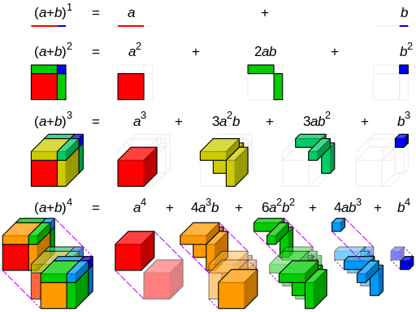

# 0. 선형대수 한줄요약!
1. 추상적인 기본 개념(Span, 독립, 기저)을 이용해 
2. '변환'이라는 행렬의 본질을 이해하고(4대 부분공간, 고유값 분해), 
3. 이 본질을 응용하여 SVD나 최소제곱법 같은 강력한 도구로 데이터를 압축/단순화하거나 
4. regression(least square)로 미래를 예측하는 것

# 1. x^a + b 에서, a는 차원임!

차원이 늘어남에 따라 visualize 방정식

# 2. Ax = b 
이거에서 모든 선대 개념이 파생됨 