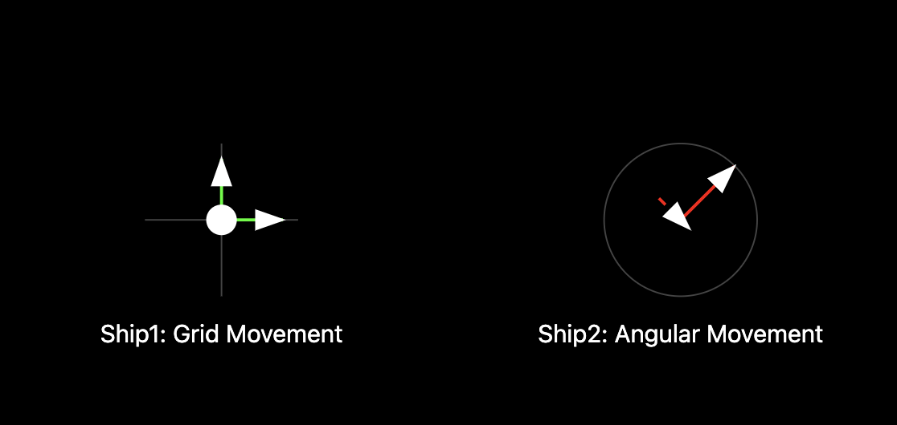

# Q. whats diff ver1, ver2?




1. ver1: 아케이트 조이스틱 방식. 4방향으로 움직임.
	- no rotation mechanics
	- simpler but less realistic
2. ver2: applying force in direction of ship's angle
	- Realistic physics with rotation and directional thrust


## ver1

Uses direct x,y coordinates for thrust
Movement is grid-based (up/down/left/right)
Thrust is applied as a constant vector

```js
thrust = vector.create(0, 0);

document.body.addEventListener("keydown", function(event) {
	// console.log(event.keyCode);
	switch(event.keyCode) {
		case 38: // up
			thrust.setY(-0.1);
			break;

		case 40: // down
			thrust.setY(0.1);
			break;

		case 37: // left
			thrust.setX(-0.1);
			break;

		case 39: // right
			thrust.setX(0.1);
			break;

		default:
			break;

	}
});
```


## ver2

Uses angle-based thrust (more realistic physics)
Rotational movement (turn left/right)
Thrust is applied in the direction ship is facing

```js
thrust = vector.create(0, 0);
angle = 0;  // Ship's rotation angle


// When pressing left/right:
if(turningLeft) {
	angle -= .05;
}
if(turningRight) {
    angle += .05;  // Rotate ship
}


// When pressing up arrow:
if(thrusting) {
	thrust.setLength(.1);
}
else {
	thrust.setLength(0);
}
thrust.setAngle(angle);

ship.accelerate(thrust);
ship.update();

```

